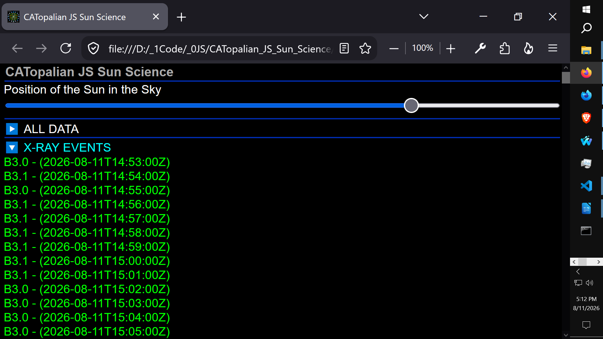

# CATopalian JS Sun Science
A JavaScript HTML, CSS, application where we fetch and show real time sun data from the internet!

---

Use App: https://christopherandrewtopalian.github.io/CATopalian_JS_Sun_Science/CATopalian_JS_Sun_Science.html

Video: https://www.youtube.com/watch?v=08htNQR0jsE

---

### How to **Download** this App
1. **Click** the green **Code Button** on this github page
2. Choose **Download ZIP**
3. **Save** the **Zip File**
4. **Extract All**
5. **Double click** the **HTML file** to start the **App**

---

Happy Scripting :-)

---

// Dedicated to God the Father  
// All Rights Reserved Christopher Andrew Topalian Copyright 2000-2026  
// https://github.com/ChristopherTopalian  
// https://github.com/ChristopherAndrewTopalian  
// https://sites.google.com/view/CollegeOfScripting

